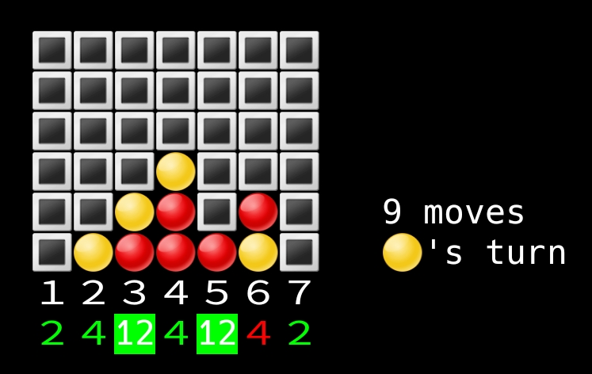

[![CC BY-NC-SA 4.0][cc-by-nc-sa-shield]][cc-by-nc-sa]

# <p align="center">connectpy</p>

<p align="center"></p>

`connectpy` is a Python module implementing the logic of the [Connect Four](https://en.wikipedia.org/wiki/Connect_Four) game.

It exposes compiled classes which allow to interact with a Connect Four board (basically allowing to play a game) and gives access to an optimized solver that can compute a score indicating if the current player of a given board position can force a win and in how many steps (a "strong" solver). An interactive game can also be played with live computation of the scores for each possible move.

The code is relatively small and can also be used as an example of how to use `pybind11` to expose C++ functions to Python.

# 🛠️ Installation

Clone or copy the project.
```
git clone https://github.com/loic-ehrhardt/connectpy
```

Download the `pybind11` dependency.
```
git submodule update --init
```

Compile the project. Either call `make` or open `connectlib.sln` with Visual Studio and compile from there. The version using `make` finds out the Python version automatically, but the Visual Studio alternative is configured to compile for Python version 3.9. This can be changed on the project properties (change additional include and library directories) or by replacing the `"C:\Program Files\Python39\"` paths in `connectlib.vcxproj` to whatever version you use.

Decompress the Opening Book data.
```
cd connectpy/
gunzip -k opening_book_8.bin.gz
```

If necessary, download the benchmark files.
```
cd benchmarks/
./download_benchmark_files.sh
```

# 🧐 Usage

```python
>>> import connectpy
```

## Play a game with `Board`

```python
>>> b = connectpy.Board()
>>> b
🔳🔳🔳🔳🔳🔳🔳
🔳🔳🔳🔳🔳🔳🔳
🔳🔳🔳🔳🔳🔳🔳
🔳🔳🔳🔳🔳🔳🔳
🔳🔳🔳🔳🔳🔳🔳   0 moves
🔳🔳🔳🔳🔳🔳🔳   🔴′s turn

>>> b.play(2)
>>> b.play(3)
>>> b
🔳🔳🔳🔳🔳🔳🔳
🔳🔳🔳🔳🔳🔳🔳
🔳🔳🔳🔳🔳🔳🔳
🔳🔳🔳🔳🔳🔳🔳
🔳🔳🔳🔳🔳🔳🔳   2 moves
🔳🔴🟡🔳🔳🔳🔳   🔴′s turn

>>> b.status
<GameStatus.InProgress: 0>
```

A `Board` can also be instantiated from a sequence of moves (string input) or a unique key integer representing it.

```python
>>> b = connectpy.Board("4455673")
>>> b
🔳🔳🔳🔳🔳🔳🔳
🔳🔳🔳🔳🔳🔳🔳
🔳🔳🔳🔳🔳🔳🔳
🔳🔳🔳🔳🔳🔳🔳
🔳🔳🔳🟡🟡🔳🔳   7 moves
🔳🔳🔴🔴🔴🔴🟡   winner: 🔴

>>> b.status
<GameStatus.Player1Wins: 2>

>>> b.key()
8831805440000

>>> connectpy.Board(8831805440000)
🔳🔳🔳🔳🔳🔳🔳
🔳🔳🔳🔳🔳🔳🔳
🔳🔳🔳🔳🔳🔳🔳
🔳🔳🔳🔳🔳🔳🔳
🔳🔳🔳🟡🟡🔳🔳   7 moves
🔳🔳🔴🔴🔴🔴🟡   winner: 🔴
```

It also has some convenience methods:

```python
>>> b = connectpy.Board(138934665985)
>>> b
🔳🔳🔳🔴🔳🔳🔳
🔳🔳🔳🔴🔳🔳🔳
🔳🔳🟡🟡🔳🔳🔳
🔳🔳🟡🔴🔳🔳🔳
🔳🟡🔴🟡🟡🔴🔳   17 moves
🔴🟡🔴🔴🔴🟡🔳   🟡′s turn

>>> b.moves
17
>>> (b.WIDTH, b.HEIGHT)
(7, 6)

# canPlay() tells if a move is allowed.
# Attempting to play on a forbidden column raises a RuntimeError.
>>> b.canPlay(3)
True
>>> b.canPlay(4)
False
>>> b.play(4)
Traceback (most recent call last):
  File "<stdin>", line 1, in <module>
RuntimeError: Cannot play there (3).
```

## Score a `Board` using a `Solver`

The `Solver` class allows to compute a score for a given `Board`. The score is positive if the current player can force a win, negative if the opposite player can force a win, and 0 if the current player can force a draw. The absolute value represents the number of remaining stones at the end of the game. For a perfect play, a player should play on the column maximizing his score. Computing this score can be quite expensive given the exponential number of possible combinations; optimization aspects are discussed on the next session. In practice, it takes up to a few seconds after the first 8 moves. For solving boards with fewer moves, one should use an `OpeningBook`, see below.

```python
>>> b = connectpy.Board(138934665985)
>>> s = connectpy.Solver()

# Compute the score with dichotomicSolve(). The score is positive.
# This means that the current player can win if playing perfectly.
>>> s.dichotomicSolve(b)
4

# One can also use negamax() to compute the score,
# but the dichotomicSolve() function is more efficient.
>>> s.negamax(b)
4

# One can play a given column and recompute the score to figure out
# which move is the good one. Here a "perfect move" is column 3 or 5.
>>> def score_if_play(board, solver, col):
...     if not board.canPlay(col):
...         return None
...     board2 = connectpy.Board(board.key()) # copy
...     board2.play(col)
...     return -solver.dichotomicSolve(board2)
>>> print("\n".join(f"play {col} -> score {score_if_play(b, s, col)}"
...                 for col in range(1, 8)))
play 1 -> score 2
play 2 -> score 3
play 3 -> score 4
play 4 -> score None
play 5 -> score 4
play 6 -> score 2
play 7 -> score 2

# Every Solver keeps track of the total number of positions explored
# for solving the boards. Also, it keeps in a transposition table the
# last scores computed for efficiency. Both can be reset.
>>> s.num_explored_pos
69294
>>> s.reset()
>>> s.num_explored_pos
0
```

The performance of the `Solver` can be assessed with the `Benchmark` class (requires to download the benchmark files, see above).

```python
>>> connectpy.Benchmark().run_all()
=== Test_L3_R1 weak ===
mean compute time: 0.020 ms
mean explored pos: 35.98
K pos / seconds:   1769.41

=== Test_L3_R1 strong ===
mean compute time: 0.022 ms
mean explored pos: 67.73
K pos / seconds:   3081.20

=== Test_L2_R1 weak ===
mean compute time: 0.122 ms
mean explored pos: 647.34
K pos / seconds:   5313.83

(...)
```

## Precomputed scores in an `OpeningBook`

Computing the score at the early stage of the game can take multiple minutes (because there are more possibilities to explore), which is not convenient for live computing scores. Example with an empty board:

```python
>>> b = connectpy.Board()
>>> s = connectpy.Solver()
>>> %time s.dichotomicSolve(b)
CPU times: user 13min 45s, sys: 4.3 s, total: 13min 49s
Wall time: 13min 40s
Out: 1 # first player can force a win!

# The Solver explored almost 4 billion positions! Note that this is actually
# much less than the total numer of positions (almost 4532 billion) thanks to
# various optimizations.
>>> s.num_explored_pos
3928286512
```

Using an opening book, which stores precomputed scores for a given maximum number of moves is an alternative to use until the search space reduces enough for the computation of the score to be quick. An opening book up to 8 moves has been precomputed (it took roughly 33 hours to compute) and can be used directly.

```python
>>> o = connectpy.OpeningBook("connectpy/opening_book_8.bin")

# "depth" gives the maximum number of moves precomputed.
>>> o.depth
8

# The score can be accessed for an eligible Board with the [] operator.
>>> (is_found, score) = o[connectpy.Board()]
>>> (is_found, score)
(True, 1)
>>> (is_found, score) = o[connectpy.Board("23")]
>>> (is_found, score)
(True, -1)
>>> (is_found, score) = o[connectpy.Board("123456712")] # 9 moves
>>> (is_found, score)
(False, 0) # not found, returned 0 score can be ignored
```

An opening book can be generated and saved to a file if desired.

```python
>>> o = connectpy.OpeningBook(8)
Will now generate opening book for depth 8.
This will take some time...
moves=8, key=596, score=0
moves=8, key=16724, score=0
moves=8, key=2097492, score=-2
moves=8, key=268435796, score=3
moves=8, key=34359738708, score=4
moves=8, key=4398046511444, score=3
(... 33 hours later ...)
moves=5, key=85983232, score=-1
moves=4, key=41943040, score=1
moves=3, key=18874368, score=-1
moves=2, key=8388608, score=1
moves=1, key=2097152, score=-1
moves=0, key=0, score=1

# Now do not forget to save the result.
>>> o.dump("my_opening_book.bin")
```

## `InteractiveGame`

One can run an interactive game with live computing of the score with `connectpy.InteractiveGame().play()` or `python -m connectpy`.


# 🚀 Optimizations

The implementation is directly inspired from the great blog series [Solving Connect 4: how to build a perfect AI](http://blog.gamesolver.org/solving-connect-four/), with added opening book, exposition to Python, and interactive game player. In more details:

- Critical code written in C++ and exposed to Python with [pybind11](https://pybind11.readthedocs.io/en/stable/basics.html).
- Brute-force search of the perfect game using the Negamax algorithm.
- Alpha-beta version of the Negamax, and dichotomic research of the score based of depth.
- The board position is represented as unsigned 64 bits integer, which allows much faster computation than with arrays.
- Optimized ordering of column for exploration search, allowing to alpha-beta prune the search space.
- Use of a 64MB transposition table to remember the recent computed scores, avoiding to re-compute old positions when it is found in the table.
- Opening book pre-computed for the first 8 moves.

The bechmark was run at different stages of the development (see `part*` tags) and can directly be compared with the benchmarks from the refered blog (results in `benchmarks/results.txt`).

# 🙇 Acknowledgements

Huge thanks to Pascal Pons for his [blog series](http://blog.gamesolver.org/solving-connect-four/) on this topic and the corresponding [source code](https://github.com/PascalPons/connect4).

Also thanks to the `pybind11` developers for this great library. The ability to easily expose C++ objects to Python is fantastic.

# ➤ License

This work is licensed under a
[Creative Commons Attribution-NonCommercial-ShareAlike 4.0 International License][cc-by-nc-sa].

[![CC BY-NC-SA 4.0][cc-by-nc-sa-image]][cc-by-nc-sa-shield]

[cc-by-nc-sa]: http://creativecommons.org/licenses/by-nc-sa/4.0/
[cc-by-nc-sa-image]: https://licensebuttons.net/l/by-nc-sa/4.0/88x31.png
[cc-by-nc-sa-shield]: https://img.shields.io/badge/License-CC%20BY--NC--SA%204.0-lightgrey.svg
